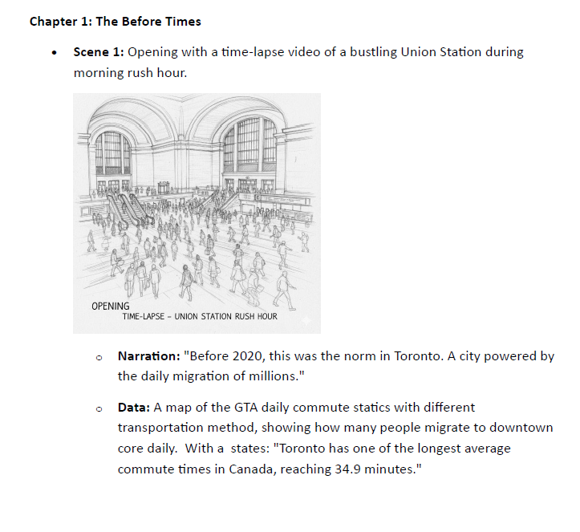

# portfolio
A curated portfolio of data visualization projects exploring urban policy, historical data redesigns, and demographic analysis. Built with HTML/CSS for MBAI 5400G.
<!DOCTYPE html>
<html lang="en">
<head>
    <meta charset="UTF-8">
    <meta name="viewport" content="width=device-width, initial-scale=1.0">
    <title>Xinyu Wang | Data Visualization Portfolio</title>
    
</head>
<body>

    
    <header>
        <h1>Xinyu Wang</h1>
        
Exploring the intersection of urban policy, history, and human stories through data visualization.

    </header>

    

        <article class="card">
            
            

                Scrollytelling & Storyboard
                <h3>The Great Re-Commute</h3>
                

                    <strong>The Challenge:</strong> Post-pandemic Toronto faces a clash between Return-to-Office mandates and Work-from-Home preferences. Abstract stats about "occupancy rates" often ignore the human cost.
                

                

                    <strong>The Solution:</strong> I created a narrative storyboard following three distinct characters—Amy (the hybrid parent), Raj (the business owner), and Leonard (the relocated worker). [cite_start]This approach transforms dry policy data into an interconnected ecosystem of urban tension. [cite: 148, 153]
                

            

        </article>

        <article class="card">
            
            

                Historical Data Analysis
                <h3>Deconstructing the Grande Armée</h3>
                

                    <strong>The Challenge:</strong> Minard’s famous 1869 map portrays Napoleon’s army as a single "monolith" marching to tragedy. [cite_start]This simplifies the reality that different regiments had vastly different outcomes. [cite: 9, 10]
                

                

                    [cite_start]<strong>The Insight:</strong> By disaggregating the data into three troops, this comparative redesign reveals that while the central force was decimated, the northern flanking regiments actually returned largely intact. [cite: 20]
                

            

        </article>

        <article class="card">
            
            

                Infographic Design
                <h3>Are We Ready for New Faces?</h3>
                

                    <strong>The Context:</strong> With 6 of the top 10 source countries for Canadian immigration now in Asia, diversity is higher than ever. However, integration success varies wildly.
                

                

                    <strong>The Insight:</strong> This visualization highlights a critical gap: Newcomers from Asia (46%) report the highest difficulty making ends meet. The design argues for targeted settlement services rather than broad "welcoming" policies.
                

            

        </article>

    

    <footer>
        
&copy; 2025 Xinyu Wang. Built for MBAI 5400G.

    </footer>

</body>
</html>
